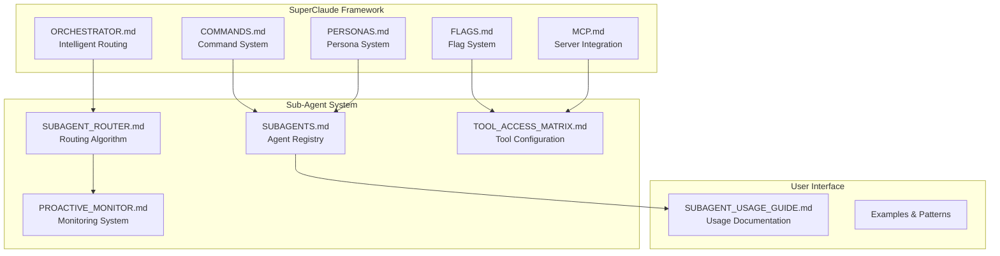

# SUBAGENT_INTEGRATION.md - SuperClaude Framework Integration

Complete integration guide for the intelligent sub-agent system with Claude Code SuperClaude framework.

## Framework Integration Overview

The intelligent sub-agent system seamlessly integrates with all SuperClaude framework components to create a unified AI workforce that automatically handles specialized tasks with world-class expertise.

## Integration Architecture



## Command Integration

### Enhanced Command Execution with Sub-Agents

```yaml
# Updated COMMANDS.md integration
command_enhancements:
  /build:
    auto_agents: [architecture-guardian, frontend-architect, performance-engineer]
    proactive_triggers: [ui_changes, config_changes, performance_issues]
    fallback_chain: [architecture-guardian, general-purpose]
    
  /implement:
    routing_analysis: true
    domain_detection: [frontend, backend, database, security]
    complexity_threshold: 0.7
    auto_agents: [domain-specific, architecture-guardian]
    
  /analyze:
    primary_agent: architecture-guardian
    secondary_agents: [security-architect, performance-engineer]
    wave_coordination: true
    parallel_analysis: true
    
  /improve:
    routing_priority: high
    quality_agents: [qa-architect, performance-engineer, security-architect]
    proactive_monitoring: enabled
    iterative_enhancement: true
    
  /design:
    mandatory_agents: [world-class-designer]
    supporting_agents: [design-scraper, design-fixer]
    accessibility_validation: automatic
    design_system_compliance: enforced
```

### Command Flag Enhancement

```typescript
interface EnhancedCommandFlags {
  // Existing flags
  '--think': boolean;
  '--uc': boolean;
  '--validate': boolean;
  
  // Sub-agent specific flags
  '--agent': string;                    // Force specific agent
  '--no-auto-agents': boolean;          // Disable automatic agent selection
  '--agent-parallel': boolean;          // Enable parallel agent execution
  '--agent-fallback': string;           // Specify fallback agent
  '--proactive-disable': boolean;       // Disable proactive monitoring
  '--agent-timeout': number;            // Agent execution timeout
  '--agent-priority': 'low' | 'medium' | 'high' | 'critical';
  
  // Quality and validation
  '--agent-validate': boolean;          // Validate agent selection
  '--quality-gates': boolean;           // Enable quality gate validation
  '--compliance-check': boolean;        // Run compliance validation
}

// Flag precedence rules
const FLAG_PRECEDENCE = [
  '--agent',              // Manual override highest priority
  '--no-auto-agents',     // Disable automation
  '--proactive-disable',  // Disable proactive system
  'auto-detection',       // Automatic routing
  'fallback-chain'        // Last resort
];
```

## Persona System Integration

### Enhanced Persona-Agent Mapping

```typescript
interface PersonaAgentMapping {
  persona: string;
  preferredAgents: string[];
  mandatoryAgents?: string[];
  proactiveAgents?: string[];
  qualityValidation?: string[];
}

const PERSONA_AGENT_MAPPINGS: PersonaAgentMapping[] = [
  {
    persona: 'architect',
    preferredAgents: ['architecture-guardian', 'database-architect'],
    mandatoryAgents: ['architecture-guardian'],
    proactiveAgents: ['architecture-guardian'],
    qualityValidation: ['qa-architect']
  },
  {
    persona: 'frontend',
    preferredAgents: ['frontend-architect', 'world-class-designer', 'design-fixer'],
    mandatoryAgents: ['design-fixer'],
    proactiveAgents: ['design-fixer', 'world-class-designer'],
    qualityValidation: ['qa-architect', 'performance-engineer']
  },
  {
    persona: 'backend',
    preferredAgents: ['database-architect', 'api-architect', 'security-architect'],
    mandatoryAgents: ['security-architect'],
    proactiveAgents: ['security-architect', 'database-architect'],
    qualityValidation: ['qa-architect', 'performance-engineer']
  },
  {
    persona: 'security',
    preferredAgents: ['security-architect', 'architecture-guardian'],
    mandatoryAgents: ['security-architect'],
    proactiveAgents: ['security-architect'],
    qualityValidation: ['qa-architect']
  },
  {
    persona: 'performance',
    preferredAgents: ['performance-engineer', 'database-architect', 'frontend-architect'],
    mandatoryAgents: ['performance-engineer'],
    proactiveAgents: ['performance-engineer'],
    qualityValidation: ['qa-architect']
  }
];
```

### Persona-Driven Agent Activation

```typescript
class PersonaAgentCoordinator {
  activatePersonaAgents(activePersona: string, taskContext: TaskContext) {
    const mapping = PERSONA_AGENT_MAPPINGS.find(m => m.persona === activePersona);
    if (!mapping) return;
    
    // Activate mandatory agents
    mapping.mandatoryAgents?.forEach(agent => {
      this.activateAgent(agent, {
        priority: 'critical',
        trigger: 'persona_mandate',
        persona: activePersona
      });
    });
    
    // Enable proactive monitoring for relevant agents
    mapping.proactiveAgents?.forEach(agent => {
      this.enableProactiveMonitoring(agent, taskContext);
    });
    
    // Set up quality validation pipeline
    mapping.qualityValidation?.forEach(agent => {
      this.scheduleQualityValidation(agent, taskContext);
    });
  }
}
```

## MCP Server Coordination

### Sub-Agent MCP Integration

```typescript
interface AgentMCPConfiguration {
  agentType: string;
  mcpServers: string[];
  serverPriority: Record<string, number>;
  fallbackStrategy: string[];
  caching: boolean;
}

const AGENT_MCP_CONFIGS: AgentMCPConfiguration[] = [
  {
    agentType: 'world-class-designer',
    mcpServers: ['Magic', 'Context7'],
    serverPriority: { 'Magic': 1, 'Context7': 2 },
    fallbackStrategy: ['Magic', 'Context7', 'WebFetch'],
    caching: true
  },
  {
    agentType: 'security-architect',
    mcpServers: ['Sequential', 'Context7'],
    serverPriority: { 'Sequential': 1, 'Context7': 2 },
    fallbackStrategy: ['Sequential', 'Context7'],
    caching: false // Security data should not be cached
  },
  {
    agentType: 'qa-architect',
    mcpServers: ['Playwright', 'Sequential', 'Context7'],
    serverPriority: { 'Playwright': 1, 'Sequential': 2, 'Context7': 3 },
    fallbackStrategy: ['Playwright', 'Sequential', 'Context7'],
    caching: true
  },
  {
    agentType: 'database-architect',
    mcpServers: ['Sequential', 'Context7'],
    serverPriority: { 'Sequential': 1, 'Context7': 2 },
    fallbackStrategy: ['Sequential', 'Context7'],
    caching: false // Database operations require fresh data
  }
];
```

### MCP-Agent Workflow Coordination

```typescript
class MCPAgentCoordinator {
  async coordinateMCPAgentWorkflow(
    agentType: string, 
    task: string, 
    mcpRequirements: string[]
  ) {
    const config = AGENT_MCP_CONFIGS.find(c => c.agentType === agentType);
    if (!config) throw new Error(`No MCP configuration for agent: ${agentType}`);
    
    // Pre-warm MCP servers
    await this.prewarmMCPServers(config.mcpServers);
    
    // Execute agent task with MCP coordination
    const result = await Task({
      description: `MCP-coordinated ${agentType} task`,
      prompt: this.generateMCPAwarePrompt(task, config),
      subagent_type: agentType
    });
    
    // Post-process with MCP validation
    return this.validateWithMCP(result, config);
  }
  
  private generateMCPAwarePrompt(task: string, config: AgentMCPConfiguration): string {
    const mcpInstructions = config.mcpServers.map(server => {
      return `- Use ${server} MCP for ${this.getMCPPurpose(server)}`;
    }).join('\n');
    
    return `
${task}

MCP Server Integration:
${mcpInstructions}

Server Priority: ${Object.entries(config.serverPriority)
  .sort(([,a], [,b]) => a - b)
  .map(([server, priority]) => `${priority}. ${server}`)
  .join(', ')}

Fallback Strategy: ${config.fallbackStrategy.join(' → ')}
    `;
  }
}
```

## Wave System Integration

### Sub-Agent Wave Coordination

```typescript
interface WaveAgentConfiguration {
  waveName: string;
  agents: string[];
  sequence: 'parallel' | 'sequential' | 'hybrid';
  dependencies: Record<string, string[]>;
  validation: string[];
}

const WAVE_AGENT_CONFIGS: WaveAgentConfiguration[] = [
  {
    waveName: 'comprehensive_security_audit',
    agents: ['security-architect', 'architecture-guardian', 'qa-architect'],
    sequence: 'sequential',
    dependencies: {
      'architecture-guardian': ['security-architect'],
      'qa-architect': ['security-architect', 'architecture-guardian']
    },
    validation: ['security-architect']
  },
  {
    waveName: 'performance_optimization',
    agents: ['performance-engineer', 'database-architect', 'frontend-architect'],
    sequence: 'parallel',
    dependencies: {},
    validation: ['performance-engineer', 'qa-architect']
  },
  {
    waveName: 'ui_design_implementation',
    agents: ['world-class-designer', 'design-fixer', 'frontend-architect', 'qa-architect'],
    sequence: 'hybrid',
    dependencies: {
      'design-fixer': ['world-class-designer'],
      'frontend-architect': ['world-class-designer'],
      'qa-architect': ['design-fixer', 'frontend-architect']
    },
    validation: ['design-fixer', 'qa-architect']
  }
];
```

### Wave-Agent Orchestration

```typescript
class WaveAgentOrchestrator {
  async executeWaveWithAgents(
    waveConfig: WaveAgentConfiguration,
    context: TaskContext
  ): Promise<WaveExecutionResult> {
    const executionPlan = this.createExecutionPlan(waveConfig);
    const results: Map<string, AgentResult> = new Map();
    
    for (const phase of executionPlan) {
      if (phase.type === 'parallel') {
        // Execute agents in parallel
        const parallelResults = await Promise.all(
          phase.agents.map(agent => this.executeAgent(agent, context))
        );
        
        phase.agents.forEach((agent, index) => {
          results.set(agent, parallelResults[index]);
        });
      } else {
        // Execute agents sequentially
        for (const agent of phase.agents) {
          const agentContext = this.buildAgentContext(context, results);
          const result = await this.executeAgent(agent, agentContext);
          results.set(agent, result);
        }
      }
      
      // Validate phase completion
      await this.validatePhase(phase, results);
    }
    
    // Final validation with validation agents
    await this.finalValidation(waveConfig.validation, results, context);
    
    return {
      success: true,
      results: Object.fromEntries(results),
      executionTime: Date.now() - context.startTime,
      phases: executionPlan.length
    };
  }
}
```

## Quality Gates Integration

### Agent-Specific Quality Gates

```typescript
interface AgentQualityGate {
  agentType: string;
  gates: QualityGateDefinition[];
  validators: string[];
  failureHandling: 'retry' | 'escalate' | 'fallback';
}

const AGENT_QUALITY_GATES: AgentQualityGate[] = [
  {
    agentType: 'design-fixer',
    gates: [
      {
        name: 'wcag_compliance',
        criteria: 'WCAG 2.2 AA compliance score >= 95%',
        validator: 'automated_accessibility_scan',
        mandatory: true
      },
      {
        name: 'design_system_alignment',
        criteria: 'Design token usage >= 90%',
        validator: 'design_system_audit',
        mandatory: true
      },
      {
        name: 'responsive_validation',
        criteria: 'All breakpoints tested and validated',
        validator: 'responsive_testing',
        mandatory: true
      }
    ],
    validators: ['qa-architect', 'frontend-architect'],
    failureHandling: 'retry'
  },
  {
    agentType: 'security-architect',
    gates: [
      {
        name: 'vulnerability_scan',
        criteria: 'Zero critical vulnerabilities',
        validator: 'security_scanner',
        mandatory: true
      },
      {
        name: 'compliance_check',
        criteria: 'OWASP Top 10 compliance',
        validator: 'compliance_audit',
        mandatory: true
      },
      {
        name: 'penetration_test',
        criteria: 'No security holes found',
        validator: 'automated_pentest',
        mandatory: false
      }
    ],
    validators: ['qa-architect'],
    failureHandling: 'escalate'
  }
];
```

### Automated Quality Validation

```typescript
class AgentQualityValidator {
  async validateAgentOutput(
    agentType: string,
    output: AgentOutput,
    context: TaskContext
  ): Promise<QualityValidationResult> {
    const qualityGate = AGENT_QUALITY_GATES.find(g => g.agentType === agentType);
    if (!qualityGate) return { passed: true, gates: [] };
    
    const gateResults: GateResult[] = [];
    
    for (const gate of qualityGate.gates) {
      const result = await this.executeQualityGate(gate, output, context);
      gateResults.push(result);
      
      if (!result.passed && gate.mandatory) {
        // Handle mandatory gate failure
        return this.handleGateFailure(qualityGate, gate, result);
      }
    }
    
    // Run validator agents if specified
    const validatorResults = await this.runValidatorAgents(
      qualityGate.validators,
      output,
      context
    );
    
    return {
      passed: gateResults.every(r => r.passed || !r.mandatory),
      gates: gateResults,
      validators: validatorResults,
      overallScore: this.calculateQualityScore(gateResults, validatorResults)
    };
  }
}
```

## Monitoring and Analytics Integration

### Agent Performance Dashboard

```typescript
interface AgentDashboardMetrics {
  agentType: string;
  executionCount: number;
  successRate: number;
  averageExecutionTime: number;
  qualityScore: number;
  proactiveActivations: number;
  userSatisfactionScore: number;
  resourceEfficiency: number;
}

class AgentAnalyticsDashboard {
  async generateDashboard(): Promise<DashboardData> {
    const agents = await this.getAllActiveAgents();
    const metrics: AgentDashboardMetrics[] = [];
    
    for (const agent of agents) {
      const agentMetrics = await this.calculateAgentMetrics(agent);
      metrics.push(agentMetrics);
    }
    
    return {
      agents: metrics,
      summary: this.calculateSummaryMetrics(metrics),
      recommendations: this.generateOptimizationRecommendations(metrics),
      proactiveInsights: await this.generateProactiveInsights(metrics)
    };
  }
  
  private generateOptimizationRecommendations(
    metrics: AgentDashboardMetrics[]
  ): Recommendation[] {
    const recommendations: Recommendation[] = [];
    
    // Find underperforming agents
    const underperformers = metrics.filter(m => m.successRate < 0.9);
    underperformers.forEach(agent => {
      recommendations.push({
        type: 'performance_improvement',
        agentType: agent.agentType,
        issue: `Success rate below threshold (${agent.successRate})`,
        solution: 'Review tool configuration and add fallback strategies',
        priority: 'high'
      });
    });
    
    // Find resource-heavy agents
    const resourceHeavy = metrics.filter(m => m.resourceEfficiency < 0.7);
    resourceHeavy.forEach(agent => {
      recommendations.push({
        type: 'resource_optimization',
        agentType: agent.agentType,
        issue: `Resource efficiency below threshold (${agent.resourceEfficiency})`,
        solution: 'Optimize tool usage and implement caching strategies',
        priority: 'medium'
      });
    });
    
    return recommendations;
  }
}
```

## Integration Testing

### Framework Integration Tests

```typescript
describe('SubAgent Framework Integration', () => {
  describe('Command Integration', () => {
    it('should automatically select appropriate agent for /build command', async () => {
      const result = await executeCommand('/build --frontend');
      
      expect(result.selectedAgents).toContain('frontend-architect');
      expect(result.proactiveAgents).toContain('design-fixer');
      expect(result.qualityValidation).toContain('qa-architect');
    });
    
    it('should respect manual agent override flags', async () => {
      const result = await executeCommand('/implement --agent security-architect');
      
      expect(result.selectedAgents).toEqual(['security-architect']);
      expect(result.automaticRouting).toBe(false);
    });
  });
  
  describe('Persona Integration', () => {
    it('should activate persona-specific agents', async () => {
      const result = await executeWithPersona('security', 'Implement authentication');
      
      expect(result.mandatoryAgents).toContain('security-architect');
      expect(result.proactiveAgents).toContain('security-architect');
      expect(result.qualityValidation).toContain('qa-architect');
    });
  });
  
  describe('MCP Coordination', () => {
    it('should coordinate MCP servers with agent execution', async () => {
      const result = await executeAgent('world-class-designer', {
        task: 'Create UI component',
        mcpServers: ['Magic', 'Context7']
      });
      
      expect(result.mcpCalls).toContain('Magic');
      expect(result.mcpCalls).toContain('Context7');
      expect(result.serverPriority).toEqual(['Magic', 'Context7']);
    });
  });
  
  describe('Quality Gates', () => {
    it('should enforce agent-specific quality gates', async () => {
      const result = await executeAgent('design-fixer', {
        task: 'Audit UI accessibility'
      });
      
      expect(result.qualityGates.wcag_compliance).toBe(true);
      expect(result.qualityGates.design_system_alignment).toBe(true);
      expect(result.overallQualityScore).toBeGreaterThan(0.9);
    });
  });
});
```

## Configuration Management

### Centralized Sub-Agent Configuration

```typescript
interface SubAgentFrameworkConfig {
  routing: RoutingConfig;
  proactive: ProactiveConfig;
  quality: QualityConfig;
  mcp: MCPConfig;
  monitoring: MonitoringConfig;
}

const DEFAULT_SUBAGENT_CONFIG: SubAgentFrameworkConfig = {
  routing: {
    enableAutomaticRouting: true,
    confidenceThreshold: 0.7,
    fallbackAgent: 'general-purpose',
    parallelExecution: true,
    maxConcurrentAgents: 5
  },
  proactive: {
    enableFileMonitoring: true,
    enablePerformanceMonitoring: true,
    enableSecurityMonitoring: true,
    monitoringInterval: 30000,
    cooldownPeriods: {
      'design-fixer': 120000,
      'security-architect': 30000,
      'performance-engineer': 180000
    }
  },
  quality: {
    enableQualityGates: true,
    mandatoryGateCompliance: true,
    qualityThreshold: 0.9,
    enableValidatorAgents: true
  },
  mcp: {
    enableMCPCoordination: true,
    serverPriority: ['Sequential', 'Context7', 'Magic', 'Playwright'],
    enableCaching: true,
    cacheTimeout: 1800000 // 30 minutes
  },
  monitoring: {
    enableAnalytics: true,
    enableDashboard: true,
    metricsRetention: 2592000000, // 30 days
    enableOptimizationRecommendations: true
  }
};
```

## Migration Guide

### Upgrading Existing Projects

```typescript
class SubAgentMigrationTool {
  async migrateToSubAgentSystem(projectPath: string): Promise<MigrationResult> {
    const steps: MigrationStep[] = [
      {
        name: 'analyze_current_setup',
        description: 'Analyze existing Claude Code configuration',
        action: () => this.analyzeCurrentSetup(projectPath)
      },
      {
        name: 'install_subagent_configs',
        description: 'Install sub-agent configuration files',
        action: () => this.installSubAgentConfigs(projectPath)
      },
      {
        name: 'update_command_patterns',
        description: 'Update command usage patterns for sub-agent integration',
        action: () => this.updateCommandPatterns(projectPath)
      },
      {
        name: 'enable_proactive_monitoring',
        description: 'Enable proactive monitoring for automatic agent activation',
        action: () => this.enableProactiveMonitoring(projectPath)
      },
      {
        name: 'configure_quality_gates',
        description: 'Set up quality gates for agent validation',
        action: () => this.configureQualityGates(projectPath)
      },
      {
        name: 'test_integration',
        description: 'Test sub-agent system integration',
        action: () => this.testIntegration(projectPath)
      }
    ];
    
    const results: StepResult[] = [];
    
    for (const step of steps) {
      try {
        const result = await step.action();
        results.push({ step: step.name, success: true, result });
      } catch (error) {
        results.push({ 
          step: step.name, 
          success: false, 
          error: error.message 
        });
        break; // Stop migration on first error
      }
    }
    
    return {
      success: results.every(r => r.success),
      steps: results,
      nextSteps: this.generateNextSteps(results)
    };
  }
}
```

This comprehensive integration ensures the sub-agent system works seamlessly with the entire SuperClaude framework, providing automatic world-class expertise for every development task.