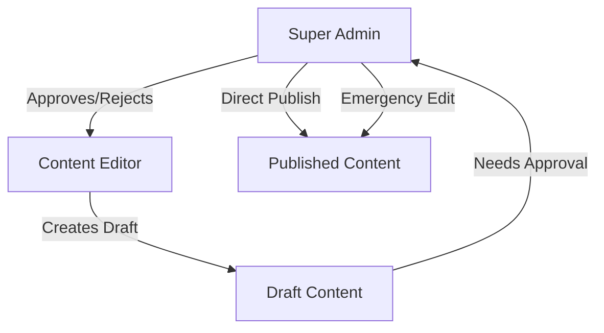
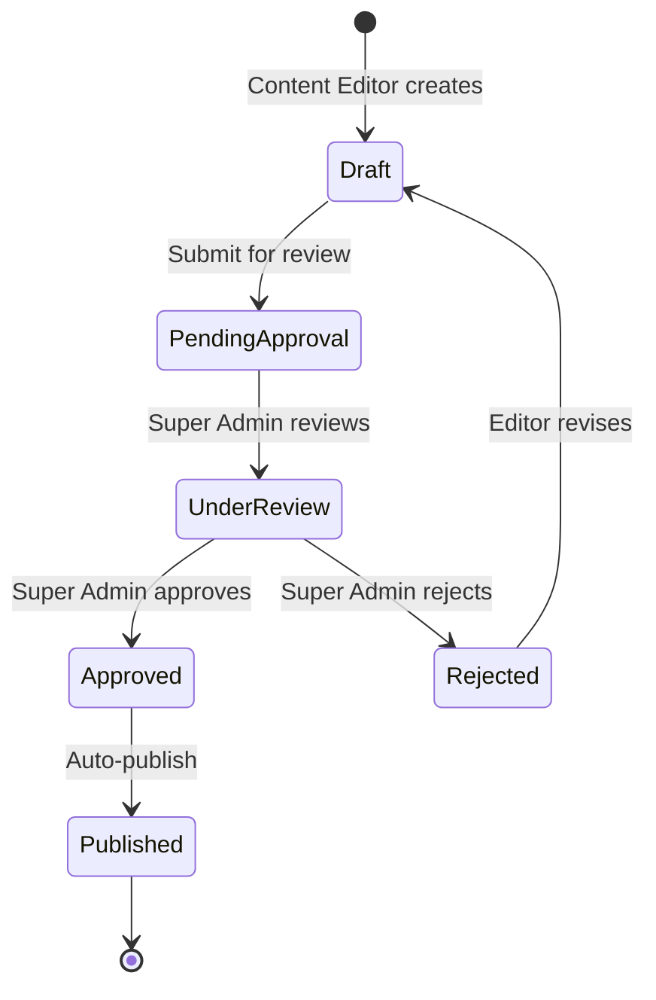

# Strapi CMS Translation System with Approval Workflow

## Overview - Clean Architecture

The ProjectDes Academy platform implements a **Strapi-only translation system** with mandatory Super Admin approval for all content changes. This ensures content quality, prevents accidental publications, and maintains brand consistency across all languages.

## 🏗️ Architecture Decision

### Why Strapi-Only Approach:

1. **Single Source of Truth**: All translations live in Strapi, no dual-table conflicts
2. **Content Editor Friendly**: Non-technical staff can manage translations
3. **Approval Workflow**: Super Admin reviews all changes before publication
4. **Version History**: Track all changes and allow rollbacks
5. **Clear Separation**: Business logic in Prisma, content in Strapi

### Database Architecture (Single Shared Database):

```yaml
PostgreSQL Database: projectdes_academy (Shared for App + CMS)
├── Application Tables (Prisma-managed):
│   ├── User
│   ├── Course
│   ├── Enrollment
│   ├── Payment
│   └── MediaAsset (for user avatars, course images)
│
└── CMS Tables (Strapi-managed with strapi_ prefix):
    ├── strapi_translations (UI strings)
    ├── strapi_files (uploaded media)
    ├── strapi_admin_users
    ├── strapi_admin_permissions
    └── strapi_workflows (approval states)
```

**Important**: Both Prisma and Strapi use the same `projectdes_academy` database. Table conflicts are avoided through Strapi's `strapi_` prefix convention.

## 👥 User Roles & Permissions

### Role Hierarchy:



### 1. **Content Editor Role**
```javascript
{
  name: "Content Editor",
  permissions: {
    translations: {
      create: true,      // Can create new translations
      update: true,      // Can edit existing translations
      delete: false,     // Cannot delete
      publish: false,    // CANNOT publish directly
      read: true,        // Can view all translations
    },
    media: {
      upload: true,      // Can upload media
      update: true,      // Can edit media metadata
      delete: false,     // Cannot delete media
      publish: false,    // Needs approval
    },
    workflow: {
      submitForApproval: true,  // Can submit for review
      viewOwnDrafts: true,       // Can see their drafts
      viewAllDrafts: false,      // Cannot see others' drafts
    }
  }
}
```

### 2. **Super Admin Role**
```javascript
{
  name: "Super Admin",
  permissions: {
    translations: {
      create: true,      // Can create
      update: true,      // Can edit
      delete: true,      // Can delete
      publish: true,     // CAN publish directly
      approve: true,     // Can approve others' changes
      reject: true,      // Can reject with feedback
    },
    media: {
      all: true,         // Full media control
    },
    workflow: {
      viewAllDrafts: true,       // See all pending approvals
      approveContent: true,      // Approve submissions
      rejectContent: true,       // Reject with feedback
      emergencyPublish: true,    // Bypass workflow if needed
      rollback: true,            // Revert to previous versions
    }
  }
}
```

### 3. **Admin Role** (Optional Middle Tier)
```javascript
{
  name: "Admin",
  permissions: {
    // Can approve specific categories only
    // E.g., Admin for Russian content only
    translations: {
      approve: ["ru"],   // Can approve Russian only
      create: true,
      update: true,
    }
  }
}
```

## 📋 Content Approval Workflow

### Standard Workflow:



### Workflow States:

```typescript
enum ContentStatus {
  DRAFT = "draft",                 // Initial creation
  PENDING_APPROVAL = "pending",    // Submitted for review
  UNDER_REVIEW = "reviewing",      // Super Admin reviewing
  APPROVED = "approved",           // Approved, awaiting publish
  PUBLISHED = "published",         // Live on website
  REJECTED = "rejected",           // Needs revision
  ARCHIVED = "archived"            // Old version
}
```

### Approval Process Implementation:

```javascript
// Strapi Content Type: Translation with Workflow
{
  "collectionName": "translations",
  "attributes": {
    "key": {
      "type": "string",
      "unique": true,
      "required": true
    },
    "ru": {
      "type": "text"
    },
    "en": {
      "type": "text"
    },
    "he": {
      "type": "text"
    },
    "category": {
      "type": "string"
    },
    "status": {
      "type": "enumeration",
      "enum": ["draft", "pending", "reviewing", "approved", "published", "rejected"],
      "default": "draft"
    },
    "submittedBy": {
      "type": "relation",
      "relation": "manyToOne",
      "target": "admin::user"
    },
    "approvedBy": {
      "type": "relation",
      "relation": "manyToOne",
      "target": "admin::user"
    },
    "rejectionReason": {
      "type": "text"
    },
    "approvalNotes": {
      "type": "text"
    },
    "submittedAt": {
      "type": "datetime"
    },
    "approvedAt": {
      "type": "datetime"
    },
    "version": {
      "type": "integer",
      "default": 1
    },
    "previousVersionId": {
      "type": "string"
    }
  }
}
```

## 🔔 Notification System

### Approval Request Notifications:

```javascript
// When Content Editor submits for approval
async function notifySuperAdmin(translationId: string) {
  const translation = await strapi.findOne('translations', translationId);
  
  // Email notification
  await strapi.plugins.email.send({
    to: superAdminEmails,
    subject: `Translation Approval Needed: ${translation.key}`,
    html: `
      <h2>New translation needs approval</h2>
      <p>Key: ${translation.key}</p>
      <p>Submitted by: ${translation.submittedBy.name}</p>
      <p>Languages modified: ${getModifiedLanguages(translation)}</p>
      <a href="${STRAPI_URL}/admin/content-manager/collectionType/api::translation.translation/${translationId}">
        Review Now
      </a>
    `
  });
  
  // In-app notification
  await strapi.create('notifications', {
    type: 'APPROVAL_NEEDED',
    recipient: 'SUPER_ADMIN',
    title: `Translation "${translation.key}" needs approval`,
    data: { translationId },
    read: false
  });
}
```

### Rejection Feedback:

```javascript
// When Super Admin rejects
async function notifyRejection(translationId: string, reason: string) {
  const translation = await strapi.findOne('translations', translationId);
  
  await strapi.plugins.email.send({
    to: translation.submittedBy.email,
    subject: `Translation Rejected: ${translation.key}`,
    html: `
      <h2>Your translation was rejected</h2>
      <p>Key: ${translation.key}</p>
      <p>Reason: ${reason}</p>
      <p>Please revise and resubmit.</p>
    `
  });
}
```

## 🗂️ Version Control & History

### Version Tracking:

```javascript
// Before updating translation, save current version
async function saveVersion(translation: Translation) {
  const version = {
    translationId: translation.id,
    key: translation.key,
    ru: translation.ru,
    en: translation.en,
    he: translation.he,
    version: translation.version,
    savedBy: currentUser.id,
    savedAt: new Date(),
    status: translation.status
  };
  
  await strapi.create('translation_versions', version);
}

// Rollback to previous version
async function rollback(translationId: string, versionId: string) {
  const version = await strapi.findOne('translation_versions', versionId);
  const translation = await strapi.findOne('translations', translationId);
  
  // Save current as version before rollback
  await saveVersion(translation);
  
  // Restore from version
  await strapi.update('translations', translationId, {
    ru: version.ru,
    en: version.en,
    he: version.he,
    version: translation.version + 1,
    status: 'published',
    approvedBy: currentUser.id,
    approvedAt: new Date()
  });
}
```

## 🚀 Emergency Override

### Super Admin Direct Publish:

```javascript
// Emergency publish without workflow
async function emergencyPublish(translationId: string, reason: string) {
  // Check if user is Super Admin
  if (!currentUser.isSuperAdmin) {
    throw new Error('Unauthorized');
  }
  
  // Log emergency action
  await strapi.create('audit_logs', {
    action: 'EMERGENCY_PUBLISH',
    entity: 'translation',
    entityId: translationId,
    reason: reason,
    performedBy: currentUser.id,
    timestamp: new Date()
  });
  
  // Direct publish
  await strapi.update('translations', translationId, {
    status: 'published',
    approvedBy: currentUser.id,
    approvedAt: new Date(),
    approvalNotes: `EMERGENCY: ${reason}`
  });
  
  // Clear cache immediately
  await clearTranslationCache(translationId);
}
```

## 🌍 Multi-Language Approval

### Language-Specific Editors:

```javascript
// Content Editor for Russian only
{
  name: "Russian Content Editor",
  permissions: {
    translations: {
      update: {
        fields: ["ru"],  // Can only edit Russian field
        condition: { language: "ru" }
      }
    }
  }
}

// Approval can be language-specific
async function approveLanguage(translationId: string, language: string) {
  const approvals = {
    ru_approved: false,
    en_approved: false,
    he_approved: false
  };
  
  approvals[`${language}_approved`] = true;
  
  // Check if all languages approved
  const allApproved = Object.values(approvals).every(v => v === true);
  
  await strapi.update('translations', translationId, {
    ...approvals,
    status: allApproved ? 'published' : 'partially_approved'
  });
}
```

## 💾 Caching Strategy

### Simple Redis Cache:

```javascript
class TranslationCache {
  private redis: Redis;
  private TTL = 300; // 5 minutes
  
  async get(key: string, language: string): Promise<string | null> {
    const cacheKey = `trans:${language}:${key}`;
    return await this.redis.get(cacheKey);
  }
  
  async set(key: string, language: string, value: string): Promise<void> {
    const cacheKey = `trans:${language}:${key}`;
    await this.redis.setex(cacheKey, this.TTL, value);
  }
  
  async invalidate(key?: string): Promise<void> {
    if (key) {
      // Clear specific translation
      await this.redis.del(`trans:*:${key}`);
    } else {
      // Clear all translations
      await this.redis.flushdb();
    }
  }
}
```

### Cache Invalidation on Approval:

```javascript
// Webhook from Strapi when content is approved
app.post('/api/webhooks/strapi/translation-approved', async (req, res) => {
  const { event, model, entry } = req.body;
  
  if (model === 'translation' && event === 'entry.publish') {
    // Clear specific translation from cache
    await cache.invalidate(entry.key);
    
    // Pre-warm cache with new translation
    for (const lang of ['ru', 'en', 'he']) {
      if (entry[lang]) {
        await cache.set(entry.key, lang, entry[lang]);
      }
    }
  }
  
  res.status(200).json({ received: true });
});
```

## 🎯 Frontend Integration

### useTranslation Hook:

```typescript
export function useTranslation() {
  const [translations, setTranslations] = useState<Record<string, string>>({});
  const language = useLanguage();
  
  const t = useCallback((key: string): string => {
    // 1. Check memory cache
    if (translations[key]) {
      return translations[key];
    }
    
    // 2. Check Redis cache (via API)
    const cached = await fetchFromCache(key, language);
    if (cached) {
      return cached;
    }
    
    // 3. Fetch from Strapi (only published content)
    const translation = await fetchFromStrapi(key, language);
    if (translation) {
      // Cache for next time
      await saveToCache(key, language, translation);
      return translation;
    }
    
    // 4. Fallback to key
    return key;
  }, [language, translations]);
  
  return { t, language };
}
```

## 📊 Monitoring & Analytics

### Track Approval Metrics:

```javascript
interface ApprovalMetrics {
  averageApprovalTime: number;      // Hours from submission to approval
  rejectionRate: number;            // % of submissions rejected
  editorProductivity: {
    [editorId: string]: {
      submitted: number;
      approved: number;
      rejected: number;
    }
  };
  superAdminWorkload: {
    pendingApprovals: number;
    approvedToday: number;
    averageReviewTime: number;
  };
}
```

## 🔒 Security Considerations

### Permission Checks:

```javascript
// Middleware to check permissions
async function checkTranslationPermission(ctx, next) {
  const { user } = ctx.state;
  const { id } = ctx.params;
  const { status } = ctx.request.body;
  
  // Only Super Admin can publish
  if (status === 'published' && !user.isSuperAdmin) {
    return ctx.forbidden('Only Super Admin can publish');
  }
  
  // Content Editor can only submit for approval
  if (user.role === 'content_editor' && status !== 'pending') {
    return ctx.forbidden('You can only submit for approval');
  }
  
  await next();
}
```

## 🚦 Migration Status

### Phase 1: Database Setup ✅
- Prisma schema does NOT include Translation or NavigationItem tables
- Single `projectdes_academy` database used for both app and CMS
- Strapi tables use `strapi_` prefix to avoid conflicts

### Phase 2: Strapi Configuration ✅
```bash
# Strapi plugins installed:
- @strapi/plugin-users-permissions
- @strapi/plugin-i18n
- Approval workflow configured in content types
- Roles and permissions set up
```

### Phase 3: Import Existing Translations
```javascript
// One-time migration script
async function migrateTranslations() {
  const existingTranslations = await prisma.translation.findMany();
  
  for (const trans of existingTranslations) {
    await strapi.create('translations', {
      key: trans.key,
      ru: trans.ru,
      en: trans.en,
      he: trans.he,
      category: trans.category,
      status: 'published',  // Existing content is pre-approved
      approvedBy: 'MIGRATION',
      approvedAt: new Date()
    });
  }
}
```

### Phase 4: Implement Caching
```javascript
// Set up Redis cache
// Configure TTL and invalidation
// Set up webhooks for cache clearing
```

## ✅ Benefits of This Approach

1. **Quality Control**: All content reviewed before publication
2. **Accountability**: Track who changed what and when
3. **No Conflicts**: Clear separation between business data and content
4. **Performance**: Simple caching with single source of truth
5. **Flexibility**: Content editors work independently, Super Admin maintains quality
6. **Security**: Role-based access control prevents unauthorized changes
7. **Rollback**: Can revert to previous versions if needed
8. **Audit Trail**: Complete history of all changes

## 🎬 Summary

This architecture provides:
- **Clean separation** between application data (Prisma) and content (Strapi)
- **Mandatory approval workflow** ensuring content quality
- **Version control** with rollback capabilities
- **Simple caching** for performance
- **Clear roles** for content management team

The system prevents the infrastructure bugs identified earlier while providing a professional content management workflow suitable for enterprise use.